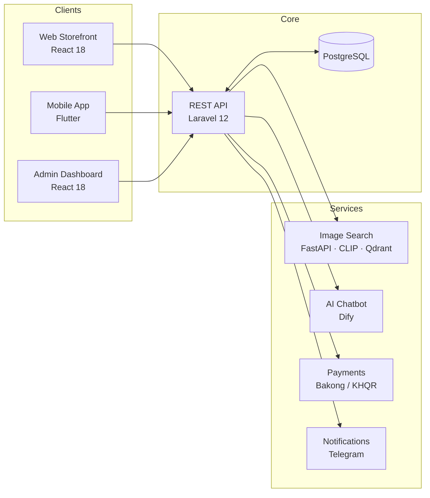

<div align="center">

# FitAndSleek

### Modern full-stack e-commerce — web, mobile, and AI-powered shopping

[](https://fitandsleekapp.kalapak-team.space)
[](https://github.com/Fitandsleek-Official)

<br />

**Laravel 12** · **React 18** · **Flutter** · **PostgreSQL** · **FastAPI** · **CLIP / Qdrant**

<br />

[Live Demo](https://fitandsleekapp.kalapak-team.space) · [Documentation](#-documentation) · [Tech Stack](#-tech-stack) · [Contact](#-contact)

</div>

---

## About

**FitAndSleek** is an end-to-end e-commerce platform built for real-world retail operations — from product catalog and inventory to checkout, payments, delivery tracking, and customer support.

We ship a unified experience across **web storefront**, **admin dashboard**, and **Flutter mobile app**, all powered by a single **Laravel REST API**.

> Shop smarter. Manage faster. Scale with confidence.

---

## Highlights

<table>
<tr>
<td width="50%">

### Storefront & Mobile
- Product browse, search & filters
- Cart, wishlist & checkout
- Order tracking & replacements
- **Visual search** — find products by photo
- AI shopping assistant (Dify)

</td>
<td width="50%">

### Admin & Operations
- Products, categories & brands
- Stock, barcodes & QR labels
- Orders, shipments & drivers
- Discounts & promotions
- Reports & analytics

</td>
</tr>
<tr>
<td width="50%">

### Payments & Auth
- **Bakong / KHQR** (Cambodia)
- Laravel Sanctum + email OTP
- Google & Facebook OAuth
- Device-bound sessions

</td>
<td width="50%">

### Integrations
- Telegram notifications & broadcasts
- Google Gemini generative AI
- CLIP + Qdrant image similarity
- Docker Compose dev stack

</td>
</tr>
</table>

---

## Architecture



---

## Tech Stack

| Layer | Technologies |
| :--- | :--- |
| **Backend** | Laravel 12, PHP 8.1+, Sanctum, PostgreSQL |
| **Web** | React 18, Vite, Tailwind CSS |
| **Mobile** | Flutter 3.9+ (iOS, Android, Web) |
| **AI / ML** | Python FastAPI, CLIP, Qdrant, Dify, Google Gemini |
| **DevOps** | Docker Compose, Composer, npm |
| **Payments** | Bakong / KHQR gateway |

<p align="center">
  
  
  
  
  
  
  
</p>

---

## Repositories

| Repository | Description | Status |
| :--- | :--- | :---: |
| **Fitandsleek** | Monorepo — API, web, mobile & AI services | Coming soon |
| **`.github`** | Organization profile & community health files | This repo |

> Pin your main repository from [Organization settings → Profile](https://github.com/organizations/Fitandsleek-Official/settings/profile) once it is public.

---

## Quick Start

```bash
# Clone the main repository (when published)
git clone https://github.com/Fitandsleek-Official/Fitandsleek.git
cd Fitandsleek

# macOS / Linux
sh setup.sh

# Windows
setup.bat
```

| Service | Default URL |
| :--- | :--- |
| API | `http://127.0.0.1:8001` |
| Web (Vite) | `http://127.0.0.1:5173` |
| Flutter web | `http://127.0.0.1:3000` |

See the project README for manual setup, environment variables, and Docker profiles.

---

## Documentation

| Topic | Description |
| :--- | :--- |
| System Architecture | Client–server design, components & integrations |
| Entity Relationship Diagram | Database schema (Chen notation) |
| Data Flow Diagram | Context & process-level DFD |
| Image Search | CLIP / Qdrant visual product search |
| Mobile App | Flutter setup & API configuration |

---

## Roadmap

- [x] Core catalog, cart & auth (web + API)
- [x] Admin dashboard & inventory labels
- [x] Flutter mobile storefront
- [x] Bakong / KHQR payments
- [x] AI chatbot & image search
- [ ] Public monorepo release on GitHub
- [ ] CI/CD pipelines & automated tests
- [ ] App Store & Play Store deployment

---

## Contributing

We welcome focused contributions. When repositories are public:

1. Fork the repository and create a feature branch from `main`
2. Keep changes scoped and tested
3. Open a pull request with a clear description

---

## Contact

<table>
<tr>
<td align="center">
<strong>Organization</strong><br />
<a href="https://github.com/Fitandsleek-Official">@Fitandsleek-Official</a>
</td>
<td align="center">
<strong>Live App</strong><br />
<a href="https://fitandsleekapp.kalapak-team.space">fitandsleekapp.kalapak-team.space</a>
</td>
<td align="center">
<strong>Issues</strong><br />
Use repository issue trackers once published
</td>
</tr>
</table>

---

<div align="center">

**FitAndSleek** — built with care for modern retail.

<br />

<sub>© FitAndSleek. All rights reserved.</sub>

</div>
