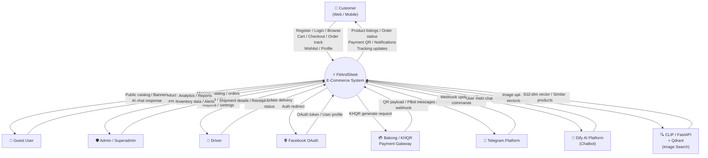
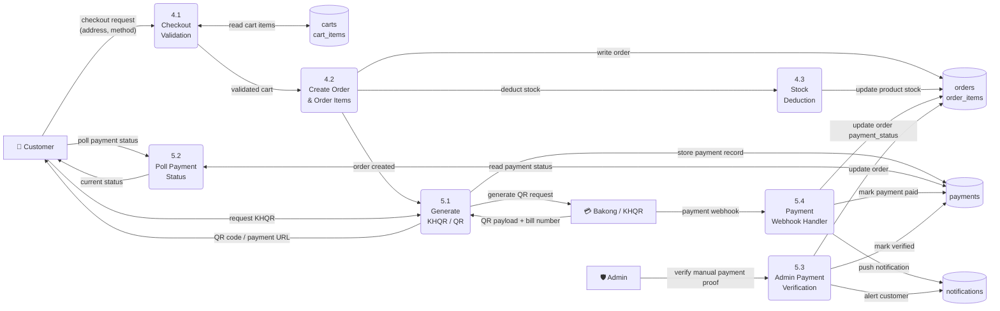
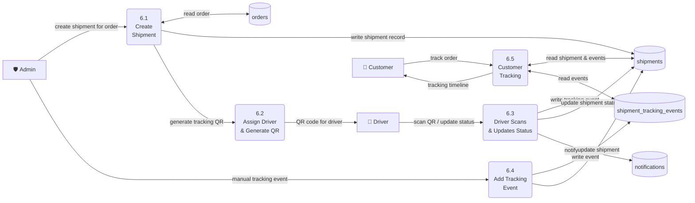
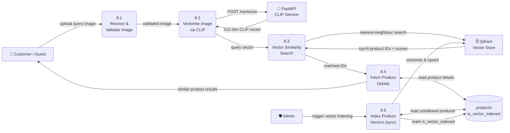

# FitAndSleek — Data Flow Diagram (DFD)

> **Stack:** Laravel 12 · PostgreSQL · React 18 · Flutter · Python FastAPI (CLIP/Qdrant)

---

## Level 0 — Context Diagram

The context diagram shows the entire FitAndSleek system as a single process and all external entities that interact with it.

---

## Level 1 — Expanded DFD

The Level 1 diagram breaks the system into its major functional processes, showing data flows between processes, external entities, and data stores.

```mermaid
flowchart LR
    %% ═══════════════════════════════════════
    %% EXTERNAL ENTITIES
    %% ═══════════════════════════════════════
    CUSTOMER["👤 Customer"]
    GUEST["👥 Guest"]
    ADMIN["🛡️ Admin"]
    DRIVER["🚚 Driver"]
    FACEBOOK["🌐 Facebook OAuth"]
    BAKONG["💳 Bakong / KHQR"]
    TELEGRAM["📨 Telegram"]
    DIFY["🤖 Dify AI"]
    CLIP["🔍 CLIP + Qdrant"]

    %% ═══════════════════════════════════════
    %% PROCESSES
    %% ═══════════════════════════════════════
    P1("1\nAuthentication\n& Security")
    P2("2\nProduct Catalog\nManagement")
    P3("3\nCart\nManagement")
    P4("4\nOrder\nProcessing")
    P5("5\nPayment\nProcessing")
    P6("6\nShipment &\nDelivery")
    P7("7\nAfter-Sale /\nReplacement")
    P8("8\nAI Image\nSearch")
    P9("9\nAdmin, POS &\nReporting")
    P10("10\nNotifications &\nMessaging")
    P11("11\nAI Chatbot")

    %% ═══════════════════════════════════════
    %% DATA STORES
    %% ═══════════════════════════════════════
    DS1[("D1 users\npersonal_access_tokens\notp_codes\nuser_device_sessions\nsecurity_audit_logs")]
    DS2[("D2 products\ncategories · brands\nproduct_images\ndiscounts · collections\nbanners · menus · settings")]
    DS3[("D3 carts\ncart_items")]
    DS4[("D4 orders\norder_items")]
    DS5[("D5 payments")]
    DS6[("D6 shipments\nshipment_tracking_events")]
    DS7[("D7 replacement_cases")]
    DS8[("D8 wishlists\nwishlist_items\naddresses")]
    DS9[("D9 notifications\ncontacts\nmessages")]
    DS10[("D10 telegram_users\ntelegram_broadcasts\nbroadcast_deliveries")]

    %% ───────────────────────────────────────
    %% P1 — Authentication & Security
    %% ───────────────────────────────────────
    CUSTOMER -->|"credentials / OTP / device info"| P1
    FACEBOOK -->|"OAuth token + profile"| P1
    P1 -->|"access token / session"| CUSTOMER
    P1 <-->|"read/write user & token records"| DS1

    %% ───────────────────────────────────────
    %% P2 — Product Catalog
    %% ───────────────────────────────────────
    CUSTOMER -->|"browse / filter / search"| P2
    GUEST -->|"browse / filter"| P2
    ADMIN -->|"create / update / delete products"| P2
    P2 -->|"product list / detail"| CUSTOMER
    P2 -->|"public catalog"| GUEST
    P2 <-->|"read/write catalog records"| DS2

    %% ───────────────────────────────────────
    %% P3 — Cart Management
    %% ───────────────────────────────────────
    CUSTOMER -->|"add / update / remove items"| P3
    P3 -->|"cart state / totals"| CUSTOMER
    P3 <-->|"read/write cart records"| DS3
    P2 -->|"product & price data"| P3

    %% ───────────────────────────────────────
    %% P4 — Order Processing
    %% ───────────────────────────────────────
    CUSTOMER -->|"checkout / address / payment method"| P4
    P4 -->|"order confirmation / order number"| CUSTOMER
    P4 <-->|"write order & items"| DS4
    P3 -->|"cart items snapshot"| P4
    P4 -->|"order created → trigger payment"| P5
    P4 -->|"order data for POS / admin"| P9

    %% ───────────────────────────────────────
    %% P5 — Payment Processing
    %% ───────────────────────────────────────
    CUSTOMER -->|"payment proof / card info"| P5
    P5 -->|"KHQR generate request"| BAKONG
    BAKONG -->|"QR payload / payment webhook"| P5
    ADMIN -->|"verify / reject payment"| P5
    P5 -->|"payment status / QR code"| CUSTOMER
    P5 <-->|"read/write payment records"| DS5
    P5 -->|"payment confirmed → notify"| P10

    %% ───────────────────────────────────────
    %% P6 — Shipment & Delivery
    %% ───────────────────────────────────────
    ADMIN -->|"create shipment / add tracking events"| P6
    DRIVER -->|"scan QR / update delivery status"| P6
    CUSTOMER -->|"track shipment"| P6
    P6 -->|"tracking status / receipt"| DRIVER
    P6 -->|"delivery updates"| CUSTOMER
    P6 <-->|"read/write shipment records"| DS6
    P6 -->|"delivery event → notify"| P10

    %% ───────────────────────────────────────
    %% P7 — After-Sale / Replacement
    %% ───────────────────────────────────────
    CUSTOMER -->|"submit replacement request"| P7
    ADMIN -->|"approve / reject / resolve case"| P7
    P7 -->|"case status"| CUSTOMER
    P7 <-->|"read/write replacement_cases"| DS7
    P7 -->|"case linked to order"| DS4

    %% ───────────────────────────────────────
    %% P8 — AI Image Search
    %% ───────────────────────────────────────
    CUSTOMER -->|"upload query image"| P8
    GUEST -->|"upload query image"| P8
    P8 -->|"image → vectorise"| CLIP
    CLIP -->|"512-dim vector / similar product IDs"| P8
    P8 <-->|"read vector-indexed products"| DS2
    P8 -->|"similar product results"| CUSTOMER
    P8 -->|"similar product results"| GUEST

    %% ───────────────────────────────────────
    %% P9 — Admin, POS & Reporting
    %% ───────────────────────────────────────
    ADMIN -->|"POS sale / barcode scan\nreport query / settings update"| P9
    P9 -->|"analytics / reports / invoices"| ADMIN
    P9 <-->|"read/write all data stores"| DS2
    P9 <-->|"read orders & order items"| DS4
    P9 <-->|"read payments"| DS5
    P9 <-->|"read shipments"| DS6

    %% ───────────────────────────────────────
    %% P10 — Notifications & Messaging
    %% ───────────────────────────────────────
    ADMIN -->|"compose broadcast / message"| P10
    P10 -->|"push notification / in-app alert"| CUSTOMER
    P10 -->|"broadcast message"| TELEGRAM
    TELEGRAM -->|"webhook / bot interaction"| P10
    P10 <-->|"read/write notifications & messages"| DS9
    P10 <-->|"read/write telegram records"| DS10

    %% ───────────────────────────────────────
    %% P11 — AI Chatbot
    %% ───────────────────────────────────────
    CUSTOMER -->|"chat message"| P11
    GUEST -->|"chat message"| P11
    P11 -->|"user query"| DIFY
    DIFY -->|"AI response"| P11
    P11 -->|"chat reply"| CUSTOMER
    P11 -->|"chat reply"| GUEST
```

---

## Level 2 — Process 1: Authentication & Security (Detailed)

```mermaid
flowchart TD
    CUSTOMER["👤 Customer / User"]
    FACEBOOK["🌐 Facebook OAuth"]
    EMAIL["📧 Email Service"]

    DS_USERS[("users")]
    DS_TOKENS[("personal_access_tokens")]
    DS_OTP[("otp_codes")]
    DS_SESSIONS[("user_device_sessions")]
    DS_TRUSTED[("user_trusted_devices")]
    DS_AUDIT[("security_audit_logs")]

    P1_1("1.1\nRegister /\nEmail Sign-up")
    P1_2("1.2\nOTP Verification")
    P1_3("1.3\nLogin\n(Password / OTP)")
    P1_4("1.4\nSocial Login\n(Facebook)")
    P1_5("1.5\nTwo-Factor\nAuthentication")
    P1_6("1.6\nSession & Device\nManagement")
    P1_7("1.7\nPassword Reset")
    P1_8("1.8\nSecurity Audit\nLogging")

    CUSTOMER -->|"name / email / password"| P1_1
    P1_1 -->|"send OTP email"| EMAIL
    P1_1 -->|"store pending user"| DS_USERS
    P1_1 -->|"store OTP hash"| DS_OTP

    CUSTOMER -->|"OTP code"| P1_2
    P1_2 <-->|"verify OTP"| DS_OTP
    P1_2 -->|"activate user"| DS_USERS

    CUSTOMER -->|"email + password"| P1_3
    P1_3 <-->|"verify credentials"| DS_USERS
    P1_3 -->|"issue Sanctum token"| DS_TOKENS
    P1_3 -->|"create device session"| DS_SESSIONS
    P1_3 -->|"access token"| CUSTOMER

    CUSTOMER -->|"Facebook OAuth"| P1_4
    FACEBOOK -->|"OAuth token + profile"| P1_4
    P1_4 <-->|"upsert user record"| DS_USERS
    P1_4 -->|"issue Sanctum token"| DS_TOKENS

    CUSTOMER -->|"2FA challenge code"| P1_5
    P1_5 <-->|"verify TOTP / recovery code"| DS_USERS
    P1_5 -->|"grant full session"| DS_TOKENS

    CUSTOMER -->|"revoke / view sessions"| P1_6
    P1_6 <-->|"read/write sessions"| DS_SESSIONS
    P1_6 <-->|"read/write trusted devices"| DS_TRUSTED
    P1_6 -->|"revoke token"| DS_TOKENS

    CUSTOMER -->|"forgot password request"| P1_7
    P1_7 -->|"send reset OTP email"| EMAIL
    P1_7 <-->|"reset password"| DS_USERS

    P1_3 -->|"log auth event"| P1_8
    P1_4 -->|"log social login event"| P1_8
    P1_5 -->|"log 2FA event"| P1_8
    P1_8 -->|"audit record"| DS_AUDIT
```

---

## Level 2 — Process 4 & 5: Order & Payment (Detailed)

---

## Level 2 — Process 6: Shipment & Delivery (Detailed)

---

## Level 2 — Process 8: AI Image Search (Detailed)

---

## Data Flow Summary

| Process | Key Inputs | Key Outputs | Data Stores Used |
|---------|-----------|-------------|-----------------|
| **1. Auth & Security** | Credentials, OTP, OAuth token, device info | Access token, session, audit log | `users`, `personal_access_tokens`, `otp_codes`, `user_device_sessions`, `security_audit_logs` |
| **2. Product Catalog** | Browse/filter/search/manage requests | Product listings, categories, banners | `products`, `categories`, `brands`, `product_images`, `discounts`, `collections`, `banners`, `menus` |
| **3. Cart** | Add/update/remove item | Cart state, totals | `carts`, `cart_items` |
| **4. Order Processing** | Checkout data, shipping address | Order confirmation, order number | `orders`, `order_items` |
| **5. Payment** | Payment info, KHQR request, proof image | QR code, payment status, webhooks | `payments` |
| **6. Shipment & Delivery** | Shipment creation, driver scans, tracking | Delivery updates, tracking timeline | `shipments`, `shipment_tracking_events` |
| **7. After-Sale** | Replacement requests | Case status, resolution | `replacement_cases` |
| **8. AI Image Search** | Query image upload | Similar product list | `products` (vector), Qdrant |
| **9. Admin, POS & Reporting** | POS sale, barcode, report query | Analytics, invoices, POS receipt | All stores |
| **10. Notifications & Messaging** | System events, admin broadcasts | Push alerts, Telegram messages | `notifications`, `messages`, `telegram_users`, `telegram_broadcasts` |
| **11. AI Chatbot** | User chat message | AI-generated response | Dify platform |

---

## External Entity Summary

| Entity | Role | Interacts With |
|--------|------|---------------|
| **Customer** | Shops, pays, tracks orders | Processes 1–8, 10, 11 |
| **Guest User** | Browses, searches, chats | Processes 2, 8, 11 |
| **Admin / Superadmin** | Manages everything, runs reports | Processes 2, 5, 6, 7, 9, 10 |
| **Driver** | Delivers orders, scans QR | Process 6 |
| **Facebook OAuth** | Social login identity provider | Process 1 |
| **Bakong / KHQR Gateway** | Processes KHQR payments | Process 5 |
| **Telegram Platform** | Receives/sends bot messages & broadcasts | Process 10 |
| **Dify AI Platform** | Powers AI chatbot responses | Process 11 |
| **CLIP FastAPI + Qdrant** | Vectorises images, returns similar products | Process 8 |
