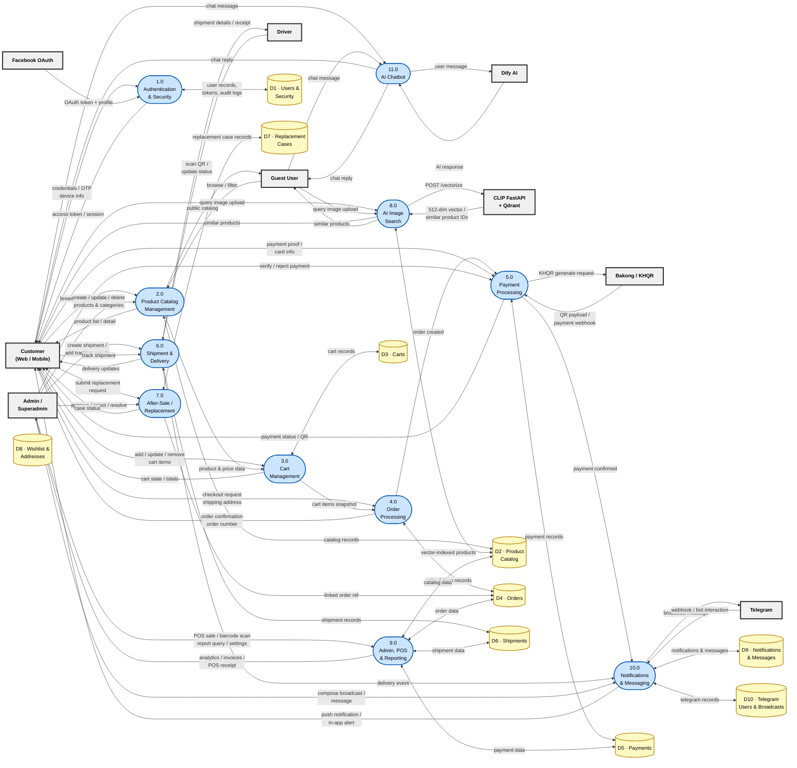
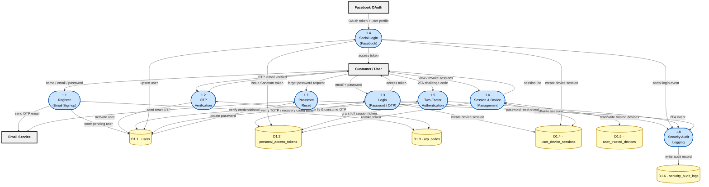
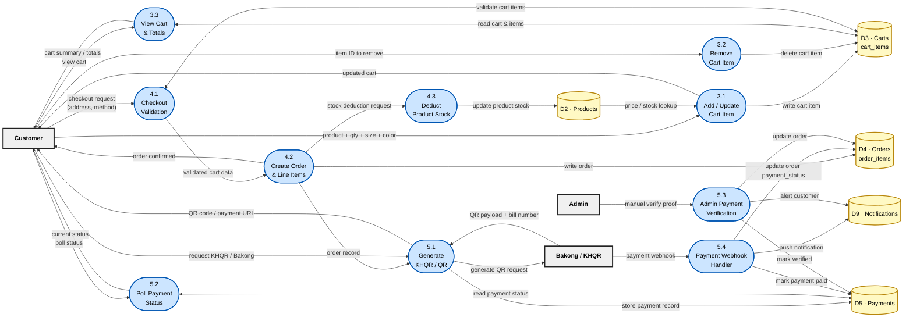
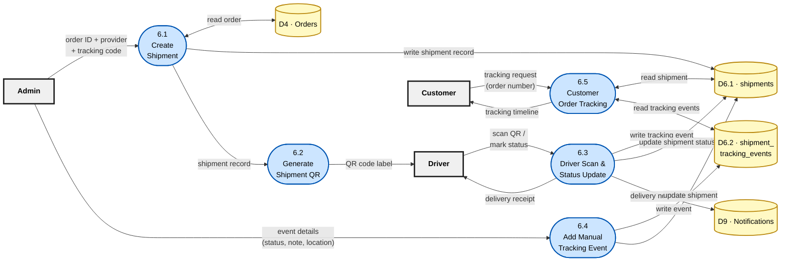
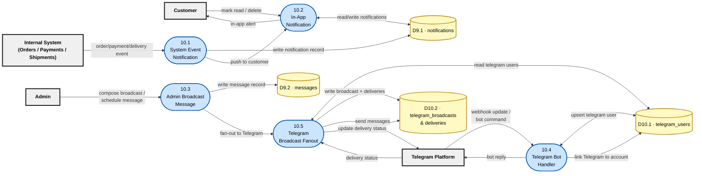

# FitAndSleek — Data Flow Diagram (Gane & Sarson Notation)

> **Stack:** Laravel 12 · PostgreSQL · React 18 · Flutter · Python FastAPI (CLIP / Qdrant)

---

## Notation Key (Gane & Sarson)

| Symbol | Shape in Diagram | Meaning |
|--------|-----------------|---------|
| Rectangle (bold border) | `[ Name ]` | **External Entity** — a person, system, or organisation that is outside the system boundary but sends or receives data |
| Rounded rectangle (blue) | `([ P# · Name ])` | **Process** — transforms or acts on data (top = ID, bottom = name) |
| Open-ended rectangle (yellow) | `[( D# · Name )]` | **Data Store** — a repository of data at rest (files, tables, queues) |
| Labelled arrow | `-->|label|` | **Data Flow** — named movement of data between elements |

---

## Level 0 — Context Diagram

> The whole FitAndSleek system is represented as a **single process bubble**. All external entities and their high-level data exchanges are shown.

```mermaid
flowchart TD
    classDef entity  fill:#f0f0f0,stroke:#222,stroke-width:3px,color:#000,font-weight:bold
    classDef process fill:#cce5ff,stroke:#0056b3,stroke-width:2px,color:#000,font-weight:bold
    classDef store   fill:#fff9c4,stroke:#b8860b,stroke-width:2px,color:#000

    %% ── External Entities ──────────────────────────────────────────────
    E1["Customer\n(Web / Mobile App)"]:::entity
    E2["Guest User"]:::entity
    E3["Admin / Superadmin"]:::entity
    E4["Driver"]:::entity
    E5["Facebook OAuth"]:::entity
    E6["Bakong / KHQR\nPayment Gateway"]:::entity
    E7["Telegram Platform"]:::entity
    E8["Dify AI Platform"]:::entity
    E9["CLIP FastAPI +\nQdrant"]:::entity

    %% ── Central Process ─────────────────────────────────────────────────
    P0(["0.0\nFitAndSleek\nE-Commerce System"]):::process

    %% ── Customer ────────────────────────────────────────────────────────
    E1 -->|"Register · Login · Browse\nCart · Checkout · Track order\nWishlist · Profile · Chat"| P0
    P0 -->|"Product listings · Order status\nPayment QR · Notifications\nDelivery tracking"| E1

    %% ── Guest ───────────────────────────────────────────────────────────
    E2 -->|"Browse products · Search\nContact form · Chatbot"| P0
    P0 -->|"Public catalog · AI chat reply"| E2

    %% ── Admin ───────────────────────────────────────────────────────────
    E3 -->|"Manage catalog · Orders\nPayments · Shipments\nReports · Settings · POS"| P0
    P0 -->|"Analytics · Reports · Invoices\nInventory status · Alerts"| E3

    %% ── Driver ──────────────────────────────────────────────────────────
    E4 -->|"Scan delivery QR\nUpdate delivery status"| P0
    P0 -->|"Shipment details · Receipt"| E4

    %% ── External services ────────────────────────────────────────────────
    E5 -->|"OAuth token · User profile"| P0
    P0 -->|"Auth redirect request"| E5

    P0 -->|"KHQR generate request"| E6
    E6 -->|"QR payload · Payment webhook"| P0

    P0 -->|"Bot messages · Broadcast"| E7
    E7 -->|"Webhook updates · Bot commands"| P0

    P0 -->|"User chat message"| E8
    E8 -->|"AI response"| P0

    P0 -->|"Image vectorise request"| E9
    E9 -->|"512-dim vector · Similar product IDs"| P0
```

---

## Level 1 — Main DFD

> The central process is exploded into **11 functional processes**. Data flows between processes, all external entities, and the main data stores are shown.

---

## Level 2 — Process 1.0: Authentication & Security

> Decomposition of the **Authentication & Security** process into six sub-processes.

---

## Level 2 — Process 3.0 · 4.0 · 5.0: Shopping, Order & Payment

> Decomposition of the **Cart → Checkout → Payment** flow.

---

## Level 2 — Process 6.0: Shipment & Delivery

> Decomposition of the **Shipment & Delivery** process.

---

## Level 2 — Process 8.0: AI Image Search

> Decomposition of the **AI-powered visual product search** process.

```mermaid
flowchart LR
    classDef entity  fill:#f0f0f0,stroke:#222,stroke-width:3px,color:#000,font-weight:bold
    classDef process fill:#cce5ff,stroke:#0056b3,stroke-width:2px,color:#000
    classDef store   fill:#fff9c4,stroke:#b8860b,stroke-width:2px,color:#000

    E1["Customer / Guest"]:::entity
    E3["Admin"]:::entity
    FASTAPI["CLIP FastAPI\nService"]:::entity
    QDRANT["Qdrant\nVector Store"]:::entity

    D2[("D2 · Products\n(is_vector_indexed)")]:::store

    P81(["8.1\nReceive &\nValidate Image"]):::process
    P82(["8.2\nVectorise Image\nvia CLIP"]):::process
    P83(["8.3\nVector Similarity\nSearch"]):::process
    P84(["8.4\nFetch &\nReturn Products"]):::process
    P85(["8.5\nProduct Vector\nIndexing (Sync)"]):::process

    %% Search flow
    E1 -->|"upload query image"| P81
    P81 -->|"validated image file"| P82
    P82 -->|"POST /vectorize"| FASTAPI
    FASTAPI -->|"512-dim CLIP vector"| P82
    P82 -->|"query vector"| P83
    P83 -->|"nearest-neighbour query"| QDRANT
    QDRANT -->|"top-N product IDs\n+ similarity scores"| P83
    P83 -->|"matched product IDs"| P84
    P84 <-->|"read product details"| D2
    P84 -->|"similar product results"| E1

    %% Admin indexing flow
    E3 -->|"trigger vector re-index"| P85
    P85 <-->|"read unindexed products"| D2
    P85 -->|"vectorise each product image"| FASTAPI
    FASTAPI -->|"product vector"| P85
    P85 -->|"upsert vectors"| QDRANT
    P85 -->|"mark is_vector_indexed = true"| D2
```

---

## Level 2 — Process 10.0: Notifications & Messaging

> Decomposition of the **Notifications & Messaging** process.

---

## Data Store Reference

| ID | Data Store | Main Tables |
|----|-----------|-------------|
| D1 | Users & Security | `users`, `personal_access_tokens`, `otp_codes`, `user_device_sessions`, `user_trusted_devices`, `security_audit_logs` |
| D2 | Product Catalog | `products`, `categories`, `brands`, `product_images`, `discounts`, `collections`, `banners`, `menus`, `settings` |
| D3 | Carts | `carts`, `cart_items` |
| D4 | Orders | `orders`, `order_items` |
| D5 | Payments | `payments` |
| D6 | Shipments | `shipments`, `shipment_tracking_events` |
| D7 | Replacement Cases | `replacement_cases` |
| D8 | Wishlist & Addresses | `wishlists`, `wishlist_items`, `addresses` |
| D9 | Notifications & Messages | `notifications`, `contacts`, `messages` |
| D10 | Telegram | `telegram_users`, `telegram_broadcasts`, `telegram_broadcast_deliveries` |

---

## External Entity Reference

| ID | Entity | Direction | Role |
|----|--------|-----------|------|
| E1 | Customer (Web / Mobile) | Bidirectional | Shops, pays, tracks, chats |
| E2 | Guest User | Bidirectional | Browses, searches, chats (unauthenticated) |
| E3 | Admin / Superadmin | Bidirectional | Manages all system data, views reports |
| E4 | Driver | Bidirectional | Delivers orders, scans QR, updates status |
| E5 | Facebook OAuth | Bidirectional | Provides identity for social sign-in |
| E6 | Bakong / KHQR Gateway | Bidirectional | Generates QR, sends payment webhooks |
| E7 | Telegram Platform | Bidirectional | Receives broadcasts, sends bot webhooks |
| E8 | Dify AI Platform | Bidirectional | Receives queries, returns AI chat responses |
| E9 | CLIP FastAPI + Qdrant | Bidirectional | Vectorises images, returns similar products |
