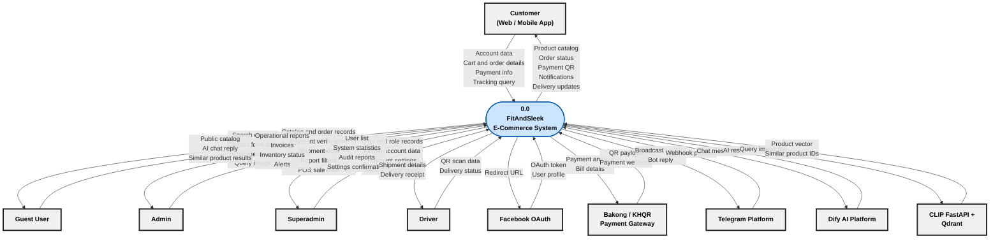
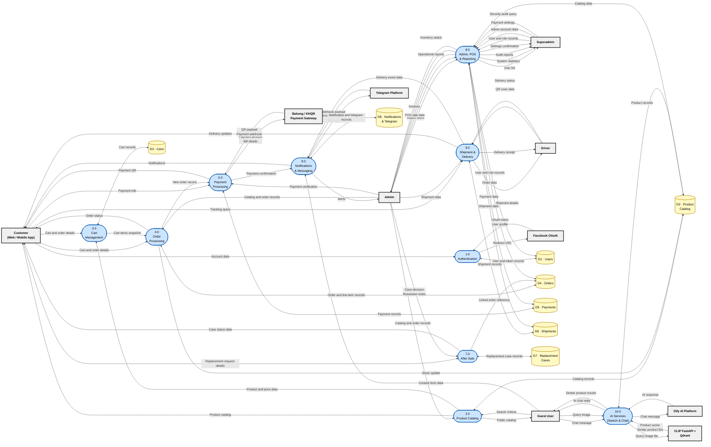
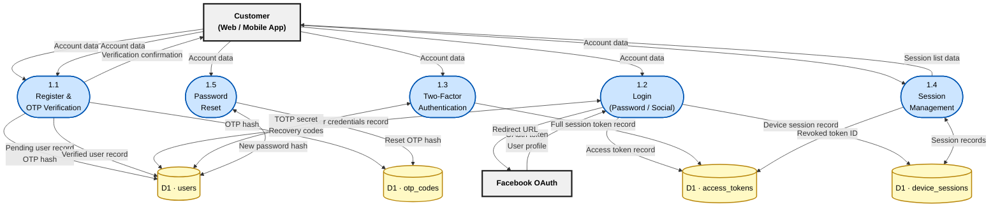
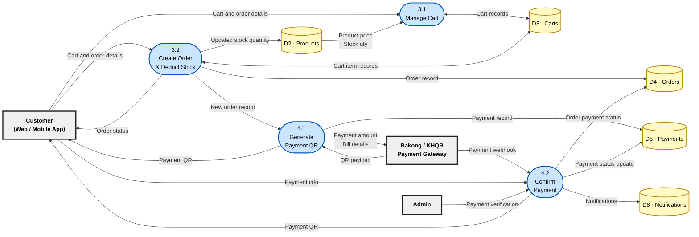
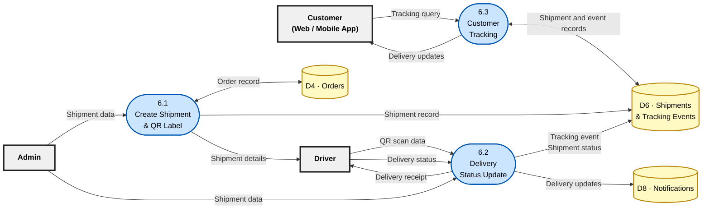
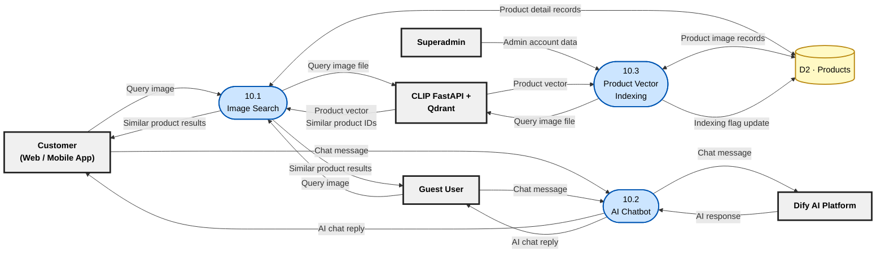

# FitAndSleek — Data Flow Diagram (Gane & Sarson Notation)

> **Stack:** Laravel 12 · PostgreSQL · React 18 · Flutter · Python FastAPI (CLIP / Qdrant)

---

## Design Principles

A DFD shows **how important data moves** through the system — not every screen, click, or background job.

| Area | Include | Leave out |
|------|---------|-----------|
| **External entities** | Roles or systems that **directly** send/receive data across the boundary (*Customer*, *Admin*, *Payment Gateway*) | Internal hand-offs between staff; duplicate roles for the same actor |
| **Data flows** | Major data payloads needed to complete a process (*Credentials*, *Order details*, *Payment receipt*) | Control triggers ("Click Submit"), trivial UI confirmations, audit/device metadata |
| **Processes** | Functional modules that **transform** data | One bubble per API endpoint or screen |
| **Levelling** | Level 0 = boundary · Level 1 = main modules · Level 2 = drill-down **only for complex flows** | Cramming all detail into one diagram |

> **គោលការណ៍:** បង្ហាញតែ entity និង data flow **សំខាន់** — ស្លាក arrow ប្រើ **noun / noun phrase** (ទិន្នន័យអ្វីហូរចូល·ចេញ) មិនប្រើ verb ឬ action របស់ user។

---

## Notation Key (Gane & Sarson)

| Symbol | Shape in Diagram | Meaning |
|--------|-----------------|---------|
| Rectangle (bold border) | `[ Name ]` | **External Entity** — outside the system boundary |
| Rounded rectangle (blue) | `([ P# · Name ])` | **Process** — transforms data (ID on top, name below) |
| Open-ended rectangle (yellow) | `[( D# · Name )]` | **Data Store** — data at rest |
| Labelled arrow | `-->|label|` | **Data Flow** — noun / noun phrase naming the **data** moved |

**Label format on diagrams:** put **one data item per line** in the arrow label (use `\n`). Do not use `·` — it is hard to read when rendered. At Level 0, multiple items on one arrow are **grouped for overview**; count each line as one data type.

| ✅ Use (data) | ❌ Avoid (action / trivial) |
|--------------|------------------------------|
| Credentials, Order details | Login, Browse, Click Submit |
| Payment receipt, QR payload | Display success message |
| Product catalog, Shipment data | Device info, Audit log entry |

---

## Level 0 — Context Diagram

> Single process bubble for the whole system. **All main external entities** are shown. Arrow labels use **one data item per line** so each type is easy to count.

**Customer ← System (P0 → E1):** **5 data types** on one grouped arrow — Product catalog, Order status, Payment QR, Notifications, Delivery updates (one per line in the label).

---

## Level 1 — Main DFD

> **10 core processes** and **8 primary data stores**. External-entity labels **match Level 0** (same names, same data items per arrow). Flows split across processes are a decomposition of the grouped Level 0 arrows. Internal hand-offs and Level 2-only detail (after-sale, audit) are shown where needed.

---

## Level 2 — Process 1.0: Authentication

> Auth is multi-path (email, OTP, social, 2FA). Five sub-processes cover the main flows; audit logging, trusted-device detail, and **Email Service** (transport only — not on Level 0) are omitted. **E1 and E5** are the only external entities; boundary labels match Level 0.

**Data stores — why all are “D1”:** At Level 1, authentication uses a single store **D1 · Users**. Level 2 **decomposes** that one store into its tables (standard DFD levelling — same parent ID, letter suffix for clarity in the diagram):

| Diagram node | Parent | Database table |
|--------------|--------|----------------|
| D1 · users | D1 | `users` |
| D1 · access_tokens | D1 | `personal_access_tokens` |
| D1 · otp_codes | D1 | `otp_codes` |
| D1 · device_sessions | D1 | `user_device_sessions` |

They are **not** D2–D8. Those IDs belong to other domains (catalog, orders, payments, etc.). `user_trusted_devices` is omitted here as session sub-detail (see *Omitted from Diagrams*).

---

## Level 2 — Process 3.0 · 4.0 · 5.0: Cart, Order & Payment

> Core purchase path — the most business-critical flow. Cart operations are grouped; payment confirmation covers both webhook and admin verification. **Boundary labels match Level 0** (*Cart and order details*, *Payment info*, *Payment QR*, E6 exchange, *Payment verification*).

---

## Level 2 — Process 6.0: Shipment & Delivery

> Three sub-processes cover create → deliver → track. Manual admin tracking events follow the same data path as driver updates and are not shown separately. **Boundary labels match Level 0** (*Shipment data*, *QR scan data*, *Delivery status*, *Shipment details*, *Delivery receipt*, *Tracking query*, *Delivery updates*).

---

## Level 2 — Process 10.0: AI Services

> Image search and chatbot share product catalog access. CLIP/Qdrant and Dify remain external; internal steps are grouped to avoid over-splitting. **Boundary labels match Level 0** (*Query image*, *Chat message*, *Similar product results*, *AI chat reply*, E8/E9 exchanges). E1/E2 are shown as separate entities where the Level 0 boundary splits them.

---

## Omitted from Diagrams *(documented here)*

These exist in the system but are **background or trivial** — they do not change how core data moves and are excluded to keep diagrams readable.

| Item | Reason omitted |
|------|----------------|
| Security audit logs | Background write on every auth event; no external data boundary |
| Trusted device records | Session sub-detail; covered under Session Management at L2 |
| Payment status polling | Repeated read of same payment record; outcome same as webhook |
| Wishlist & addresses | Customer profile feature; flows mirror catalog + user store pattern |
| Separate Telegram bot vs broadcast | Both are message payloads to/from E7; merged at Level 1 |
| Email Service entity | Transport only (SMTP/mail provider); OTP and reset codes are stored in **D1 · otp_codes** — no separate external entity at any level |
| Admin / Superadmin login | Same *Account data* path as Customer at L0; not repeated on E3/E10 boundary |
| After-sale replacement | Operational sub-flow under 7.0; not on Level 0 context boundary |

---

## Data Store Reference

| ID | Data Store | Main Tables |
|----|-----------|-------------|
| D1 | Users | `users`, `personal_access_tokens`, `otp_codes`, `user_device_sessions`, `user_trusted_devices` |

**D1 at Level 2 (Authentication drill-down):** one logical store split by table — D1 · users, D1 · access_tokens, D1 · otp_codes, D1 · device_sessions. All remain **D1**; only the suffix/name changes in the diagram.
| D2 | Product Catalog | `products`, `categories`, `brands`, `product_images`, `discounts`, `collections`, `banners` |
| D3 | Carts | `carts`, `cart_items` |
| D4 | Orders | `orders`, `order_items` |
| D5 | Payments | `payments` |
| D6 | Shipments | `shipments`, `shipment_tracking_events` |
| D7 | Replacement Cases | `replacement_cases` |
| D8 | Notifications & Telegram | `notifications`, `messages`, `telegram_users`, `telegram_broadcasts`, `telegram_broadcast_deliveries` |

> **Also in database (not on DFD):** `wishlists`, `wishlist_items`, `addresses`, `contacts`, `security_audit_logs`, `settings`, `menus`

---

## External Entity Reference

| ID | Entity | Core data exchanged |
|----|--------|---------------------|
| E1 | Customer (Web / Mobile) | Account data, cart/order details, payment info, tracking queries |
| E2 | Guest User | Search criteria, contact form, chat message, query image |
| E3 | Admin | Catalog/order records, payment verification, shipments, POS, operational reports |
| E10 | Superadmin | User & role records, admin accounts, payment settings, security audit, system statistics |
| E4 | Driver | QR scan data, delivery status; receives shipment details & receipt |
| E5 | Facebook OAuth | OAuth token, user profile, redirect URL |
| E6 | Bakong / KHQR Gateway | Payment amount, QR payload, payment webhook |
| E7 | Telegram Platform | Broadcast content, webhook payload, bot reply |
| E8 | Dify AI Platform | Chat message, AI response |
| E9 | CLIP FastAPI + Qdrant | Query image, product vectors, similar product IDs |

### Admin vs Superadmin — data scope

| Data domain | Admin (E3) | Superadmin (E10) |
|-------------|------------|------------------|
| Product catalog, orders, payments, shipments | Operational CRUD & verification | Full access *(same flows shown via E3)* |
| POS sales & operational reports | ✅ | ✅ *(via E3 flows)* |
| User & role management, admin accounts | — | ✅ |
| Payment gateway settings | — | ✅ |
| Security audit logs & system statistics | — | ✅ |
| Product vector re-indexing | — | ✅ |

> Superadmin can perform all Admin operations; operational flows are attributed to **E3** to avoid duplicate arrows. **E10** shows data flows unique to superadmin governance.

---

## Levelling Summary

| Level | Scope | FitAndSleek coverage |
|-------|-------|---------------------|
| **0** | System boundary | 1 process · 10 external entities · grouped critical flows |
| **1** | Main modules | 10 processes · 8 data stores · **external labels identical to Level 0** |
| **2** | Complex drill-down | Auth · Cart/Order/Payment · Delivery · AI Services (4 diagrams) · **boundary labels match Level 0** |
| **3+** | Not used | Detail covered by ERD / Data Dictionary instead |

### Level 0 → Level 1 reconciliation

| Level 0 entity | Level 0 data (→ system) | Decomposed to |
|----------------|---------------------------|---------------|
| E1 Customer | Account data | 1.0 Authentication |
| E1 Customer | Cart and order details | 3.0 Cart · 4.0 Order |
| E1 Customer | Payment info | 5.0 Payment |
| E1 Customer | Tracking query | 6.0 Shipment |
| E2 Guest | Search criteria | 2.0 Product Catalog |
| E2 Guest | Contact form data | 9.0 Notifications |
| E2 Guest | Chat message · Query image | 10.0 AI Services |
| E3 Admin | Catalog and order records | 2.0 · 4.0 |
| E3 Admin | Payment verification | 5.0 |
| E3 Admin | Shipment data | 6.0 |
| E3 Admin | Report filters · POS sale data | 8.0 Admin & Reporting |
| E10 Superadmin | User/role · Admin account · Payment settings · Audit query | 8.0 Admin & Reporting |
| E4 Driver | QR scan data · Delivery status | 6.0 Shipment |
| E5–E9 | *(same labels as Level 0)* | 1.0 · 5.0 · 9.0 · 10.0 respectively |

| Level 0 entity | Level 0 data (system →) | Decomposed from |
|----------------|---------------------------|---------------|
| E1 Customer | Product catalog | 2.0 Product Catalog |
| E1 Customer | Order status | 4.0 Order |
| E1 Customer | Payment QR | 5.0 Payment |
| E1 Customer | Notifications | 9.0 Notifications |
| E1 Customer | Delivery updates | 6.0 Shipment |
| E2 Guest | Public catalog | 2.0 Product Catalog |
| E2 Guest | AI chat reply · Similar product results | 10.0 AI Services |
| E3 Admin | Operational reports · Invoices · Inventory status | 8.0 Admin & Reporting |
| E3 Admin | Alerts | 9.0 Notifications |
| E10 Superadmin | User list · System statistics · Audit reports · Settings confirmation | 8.0 Admin & Reporting |
| E4 Driver | Shipment details · Delivery receipt | 6.0 Shipment |

---

## Level 1 — Entity & Process Reference (Text)

> Plain-text map of **who talks to which process** at Level 1. Labels match the diagram above.

### By entity

**E1 — Customer (Web / Mobile App)**
- → **1.0 Authentication** — Account data
- → **3.0 Cart Management** — Cart and order details
- → **4.0 Order Processing** — Cart and order details
- → **5.0 Payment Processing** — Payment info
- → **6.0 Shipment & Delivery** — Tracking query
- → **7.0 After-Sale** — Replacement request details
- ← **2.0 Product Catalog** — Product catalog
- ← **4.0 Order Processing** — Order status
- ← **5.0 Payment Processing** — Payment QR
- ← **9.0 Notifications & Messaging** — Notifications
- ← **6.0 Shipment & Delivery** — Delivery updates
- ← **7.0 After-Sale** — Case status data

**E2 — Guest User**
- → **2.0 Product Catalog** — Search criteria
- → **9.0 Notifications & Messaging** — Contact form data
- → **10.0 AI Services** — Chat message, Query image
- ← **2.0 Product Catalog** — Public catalog
- ← **10.0 AI Services** — AI chat reply, Similar product results

**E3 — Admin**
- → **2.0 Product Catalog** — Catalog and order records
- → **4.0 Order Processing** — Catalog and order records
- → **5.0 Payment Processing** — Payment verification
- → **6.0 Shipment & Delivery** — Shipment data
- → **8.0 Admin, POS & Reporting** — Report filters, POS sale data
- → **7.0 After-Sale** — Case decision, Resolution notes
- ← **8.0 Admin, POS & Reporting** — Operational reports, Invoices, Inventory status
- ← **9.0 Notifications & Messaging** — Alerts

**E10 — Superadmin**
- → **8.0 Admin, POS & Reporting** — User and role records, Admin account data, Payment settings, Security audit query
- ← **8.0 Admin, POS & Reporting** — User list, System statistics, Audit reports, Settings confirmation

**E4 — Driver**
- → **6.0 Shipment & Delivery** — QR scan data, Delivery status
- ← **6.0 Shipment & Delivery** — Shipment details, Delivery receipt

**E5 — Facebook OAuth**
- ↔ **1.0 Authentication** — Redirect URL / OAuth token, User profile

**E6 — Bakong / KHQR Payment Gateway**
- ↔ **5.0 Payment Processing** — Payment amount, Bill details / QR payload, Payment webhook

**E7 — Telegram Platform**
- ↔ **9.0 Notifications & Messaging** — Broadcast content, Bot reply / Webhook payload

**E8 — Dify AI Platform**
- ↔ **10.0 AI Services** — Chat message / AI response

**E9 — CLIP FastAPI + Qdrant**
- ↔ **10.0 AI Services** — Query image file / Product vector, Similar product IDs

### By process

| Process | Related entities |
|---------|------------------|
| **1.0 Authentication** | E1, E5 |
| **2.0 Product Catalog** | E1, E2, E3 |
| **3.0 Cart Management** | E1 |
| **4.0 Order Processing** | E1, E3 |
| **5.0 Payment Processing** | E1, E3, E6 |
| **6.0 Shipment & Delivery** | E1, E3, E4 |
| **7.0 After-Sale** | E1, E3 |
| **8.0 Admin, POS & Reporting** | E3, E10 |
| **9.0 Notifications & Messaging** | E1, E2, E3, E7 |
| **10.0 AI Services** | E2, E8, E9 |

### Process ↔ process (internal)

| From | To | Data |
|------|-----|------|
| 2.0 Product Catalog | 3.0 Cart Management | Product and price data |
| 3.0 Cart Management | 4.0 Order Processing | Cart items snapshot |
| 4.0 Order Processing | 5.0 Payment Processing | New order record |
| 5.0 Payment Processing | 9.0 Notifications & Messaging | Payment confirmation |
| 6.0 Shipment & Delivery | 9.0 Notifications & Messaging | Delivery event data |
