# FitAndSleek - Full Chen ERD (Edraw Copy/Paste Ready)

This file gives you:
- A full **Chen-style visual ERD** (rectangle entity, diamond relationship, oval attributes).
- A **key attribute list** (important fields only: PK, FK, and core business fields).
- An **Edraw copy blueprint** you can paste and draw quickly.

## 1) Full Chen Visual (Mermaid)

```mermaid
flowchart TB
    classDef entity fill:#00ACC1,stroke:#006064,color:#fff,font-weight:bold,stroke-width:2px
    classDef relation fill:#AD1457,stroke:#880E4F,color:#fff,font-weight:bold
    classDef attr fill:#EC407A,stroke:#C2185B,color:#fff

    USER[User]:::entity
    ADDR[Address]:::entity
    NOTI[Notification]:::entity
    CART[Cart]:::entity
    CI[Cart Item]:::entity
    WISH[Wishlist]:::entity
    WI[Wishlist Item]:::entity
    ORD[Order]:::entity
    OI[Order Item]:::entity
    PAY[Payment]:::entity
    SHIP[Shipment]:::entity
    TRACK[Tracking Event]:::entity
    REP[Replacement Case]:::entity
    BRAND[Brand]:::entity
    CAT[Category]:::entity
    PROD[Product]:::entity
    DISC[Discount]:::entity
    PIMG[Product Image]:::entity
    TGU[Telegram User]:::entity
    BCAST[Telegram Broadcast]:::entity
    BDEL[Broadcast Delivery]:::entity
    UDS[User Device Session]:::entity
    UTD[User Trusted Device]:::entity
    SAL[Security Audit Log]:::entity
    MSG[Message]:::entity

    R1{Has Address}:::relation
    R2{Receives}:::relation
    R3{Owns Cart}:::relation
    R4{Contains}:::relation
    R5{In Cart}:::relation
    R6{Owns Wishlist}:::relation
    R7{Contains}:::relation
    R8{Wished Product}:::relation
    R9{Places}:::relation
    R10{Contains}:::relation
    R11{Refers Product}:::relation
    R12{Paid By}:::relation
    R13{Shipped As}:::relation
    R14{Tracked By}:::relation
    R15{Replaces}:::relation
    R16{Categorizes}:::relation
    R17{Produces}:::relation
    R18{Discounted}:::relation
    R19{Has Images}:::relation
    R20{Linked To}:::relation
    R21{Creates}:::relation
    R22{Sent To}:::relation
    R23{Session Logs}:::relation
    R24{Trusted Devices}:::relation
    R25{Audit Logs}:::relation
    R26{Creates Message}:::relation

    %% one attribute oval per entity (important fields only)
    A_USER([id, name, email, role, status]):::attr
    A_ADDR([id, user_id, receiver_name, receiver_phone, province, city, is_default]):::attr
    A_NOTI([id, user_id, type, title, is_read]):::attr
    A_CART([id, user_id, guest_token, status]):::attr
    A_CI([id, cart_id, product_id, color, size, quantity, unit_price]):::attr
    A_WISH([id, user_id, name, is_default]):::attr
    A_WI([id, wishlist_id, product_id]):::attr
    A_ORD([id, user_id, order_number, status, payment_status, payment_method, total]):::attr
    A_OI([id, order_id, product_id, name, sku, price, qty, line_total]):::attr
    A_PAY([id, order_id, verified_by, provider, method, status, amount, reference_code, paid_at]):::attr
    A_SHIP([id, order_id, provider, tracking_code, status, shipped_at, delivered_at]):::attr
    A_TRACK([id, shipment_id, updated_by, status, location, event_time]):::attr
    A_REP([id, order_id, handled_by, reason, status]):::attr
    A_BRAND([id, name, slug, is_active]):::attr
    A_CAT([id, parent_id, name, slug, type, is_active]):::attr
    A_PROD([id, category_id, brand_id, sku, name, price, stock, is_active]):::attr
    A_DISC([id, product_id, discount_type, discount_value, sale_price, start_date, end_date, is_active]):::attr
    A_PIMG([id, product_id, path, is_primary, sort_order]):::attr
    A_TGU([id, user_id, telegram_user_id, chat_id, username]):::attr
    A_BCAST([id, created_by, target, status, total_recipients, sent_count, failed_count]):::attr
    A_BDEL([id, broadcast_id, telegram_user_id, status, attempt_count, sent_at]):::attr
    A_UDS([id, user_id, device_id, ip_address, last_login_at, last_used_at]):::attr
    A_UTD([id, user_id, device_id, verified_at, last_seen_at]):::attr
    A_SAL([id, user_id, event_type, ip_address, created_at]):::attr
    A_MSG([id, created_by, title, target_audience, is_active, scheduled_at]):::attr

    USER --- A_USER
    ADDR --- A_ADDR
    NOTI --- A_NOTI
    CART --- A_CART
    CI --- A_CI
    WISH --- A_WISH
    WI --- A_WI
    ORD --- A_ORD
    OI --- A_OI
    PAY --- A_PAY
    SHIP --- A_SHIP
    TRACK --- A_TRACK
    REP --- A_REP
    BRAND --- A_BRAND
    CAT --- A_CAT
    PROD --- A_PROD
    DISC --- A_DISC
    PIMG --- A_PIMG
    TGU --- A_TGU
    BCAST --- A_BCAST
    BDEL --- A_BDEL
    UDS --- A_UDS
    UTD --- A_UTD
    SAL --- A_SAL
    MSG --- A_MSG

    USER ---|"1"| R1 ---|"N"| ADDR
    USER ---|"1"| R2 ---|"N"| NOTI
    USER ---|"1"| R3 ---|"N"| CART
    CART ---|"1"| R4 ---|"N"| CI
    CI ---|"N"| R5 ---|"1"| PROD
    USER ---|"1"| R6 ---|"N"| WISH
    WISH ---|"1"| R7 ---|"N"| WI
    WI ---|"N"| R8 ---|"1"| PROD
    USER ---|"1"| R9 ---|"N"| ORD
    ORD ---|"1"| R10 ---|"N"| OI
    OI ---|"N"| R11 ---|"1"| PROD
    ORD ---|"1"| R12 ---|"N"| PAY
    ORD ---|"1"| R13 ---|"1"| SHIP
    SHIP ---|"1"| R14 ---|"N"| TRACK
    ORD ---|"1"| R15 ---|"N"| REP
    CAT ---|"1"| R16 ---|"N"| PROD
    BRAND ---|"1"| R17 ---|"N"| PROD
    PROD ---|"1"| R18 ---|"0..1"| DISC
    PROD ---|"1"| R19 ---|"N"| PIMG
    USER ---|"1"| R20 ---|"0..1"| TGU
    USER ---|"1"| R21 ---|"N"| BCAST
    BCAST ---|"1"| R22 ---|"N"| BDEL
    TGU ---|"1"| R22 ---|"N"| BDEL
    USER ---|"1"| R23 ---|"N"| UDS
    USER ---|"1"| R24 ---|"N"| UTD
    USER ---|"1"| R25 ---|"N"| SAL
    USER ---|"1"| R26 ---|"N"| MSG
```



## 2) Edraw Copy Blueprint (Direct Paste Text)

Copy this section into your notes panel in Edraw and draw by line:

```text
=== ENTITIES (Rectangle) ===
User
Address
Notification
Cart
Cart Item
Wishlist
Wishlist Item
Order
Order Item
Payment
Shipment
Tracking Event
Replacement Case
Brand
Category
Product
Discount
Product Image
Telegram User
Telegram Broadcast
Broadcast Delivery
User Device Session
User Trusted Device
Security Audit Log
Message

=== RELATIONSHIPS (Diamond) ===
Has Address
Receives
Owns Cart
Contains (Cart-CartItem)
In Cart
Owns Wishlist
Contains (Wishlist-WishlistItem)
Wished Product
Places
Contains (Order-OrderItem)
Refers Product
Paid By
Shipped As
Tracked By
Replaces
Categorizes
Produces
Discounted
Has Images
Linked To
Creates Broadcast
Sent To
Session Logs
Trusted Devices
Audit Logs
Creates Message

=== CONNECTORS WITH CARDINALITY ===
User (1) -- Has Address -- (N) Address
User (1) -- Receives -- (N) Notification
User (1) -- Owns Cart -- (N) Cart
Cart (1) -- Contains (Cart-CartItem) -- (N) Cart Item
Cart Item (N) -- In Cart -- (1) Product
User (1) -- Owns Wishlist -- (N) Wishlist
Wishlist (1) -- Contains (Wishlist-WishlistItem) -- (N) Wishlist Item
Wishlist Item (N) -- Wished Product -- (1) Product
User (1) -- Places -- (N) Order
Order (1) -- Contains (Order-OrderItem) -- (N) Order Item
Order Item (N) -- Refers Product -- (1) Product
Order (1) -- Paid By -- (N) Payment
Order (1) -- Shipped As -- (1) Shipment
Shipment (1) -- Tracked By -- (N) Tracking Event
Order (1) -- Replaces -- (N) Replacement Case
Category (1) -- Categorizes -- (N) Product
Brand (1) -- Produces -- (N) Product
Product (1) -- Discounted -- (0..1) Discount
Product (1) -- Has Images -- (N) Product Image
User (1) -- Linked To -- (0..1) Telegram User
User (1) -- Creates Broadcast -- (N) Telegram Broadcast
Telegram Broadcast (1) -- Sent To -- (N) Broadcast Delivery
Telegram User (1) -- Sent To -- (N) Broadcast Delivery
User (1) -- Session Logs -- (N) User Device Session
User (1) -- Trusted Devices -- (N) User Trusted Device
User (1) -- Audit Logs -- (N) Security Audit Log
User (1) -- Creates Message -- (N) Message
```

## 3) Important Attributes (Use as Oval Text in Edraw)

- `User`: `id`, `name`, `email`, `role`, `status`
- `Address`: `id`, `user_id`, `receiver_name`, `receiver_phone`, `province`, `city`, `is_default`
- `Notification`: `id`, `user_id`, `type`, `title`, `is_read`
- `Cart`: `id`, `user_id`, `guest_token`, `status`
- `Cart Item`: `id`, `cart_id`, `product_id`, `color`, `size`, `quantity`, `unit_price`
- `Wishlist`: `id`, `user_id`, `name`, `is_default`
- `Wishlist Item`: `id`, `wishlist_id`, `product_id`
- `Order`: `id`, `user_id`, `order_number`, `status`, `payment_status`, `payment_method`, `total`
- `Order Item`: `id`, `order_id`, `product_id`, `name`, `sku`, `price`, `qty`, `line_total`
- `Payment`: `id`, `order_id`, `verified_by`, `provider`, `method`, `status`, `amount`, `reference_code`, `paid_at`
- `Shipment`: `id`, `order_id`, `provider`, `tracking_code`, `status`, `shipped_at`, `delivered_at`
- `Tracking Event`: `id`, `shipment_id`, `updated_by`, `status`, `location`, `event_time`
- `Replacement Case`: `id`, `order_id`, `handled_by`, `reason`, `status`
- `Brand`: `id`, `name`, `slug`, `is_active`
- `Category`: `id`, `parent_id`, `name`, `slug`, `type`, `is_active`
- `Product`: `id`, `category_id`, `brand_id`, `sku`, `name`, `price`, `stock`, `is_active`
- `Discount`: `id`, `product_id`, `discount_type`, `discount_value`, `sale_price`, `start_date`, `end_date`, `is_active`
- `Product Image`: `id`, `product_id`, `path`, `is_primary`, `sort_order`
- `Telegram User`: `id`, `user_id`, `telegram_user_id`, `chat_id`, `username`
- `Telegram Broadcast`: `id`, `created_by`, `target`, `status`, `total_recipients`, `sent_count`, `failed_count`
- `Broadcast Delivery`: `id`, `broadcast_id`, `telegram_user_id`, `status`, `attempt_count`, `sent_at`
- `User Device Session`: `id`, `user_id`, `device_id`, `ip_address`, `last_login_at`, `last_used_at`
- `User Trusted Device`: `id`, `user_id`, `device_id`, `verified_at`, `last_seen_at`
- `Security Audit Log`: `id`, `user_id`, `event_type`, `ip_address`, `created_at`
- `Message`: `id`, `created_by`, `title`, `target_audience`, `is_active`, `scheduled_at`

## 4) Edraw Styling Guide (Chen)

- Entity shape: rectangle, fill `#00ACC1`
- Relationship shape: diamond, fill `#AD1457`
- Attribute shape: oval, fill `#EC407A`
- Put cardinality text near connectors: `1`, `N`, `0..1`
