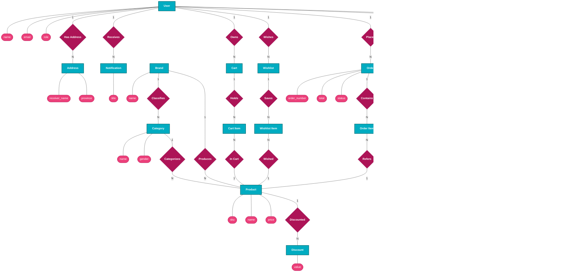

# FitAndSleek — Entity Relationship Diagram (Chen Notation)

> **Stack:** Laravel 12 · PostgreSQL · React 18 · Flutter · Python FastAPI (CLIP / Qdrant)

---

## Legend

| Symbol | Shape | Meaning |
|--------|-------|---------|
| Rectangle | `[ ]` | **Entity** (Teal) |
| Diamond   | `{ }` | **Relationship / Action** (Dark Pink) |
| Oval      | `([ ])` | **Attribute** (Pink) |
| `1`, `N`, `0..1` | line label | **Cardinality** |

---

## Full Chen ERD

---

## Entity Groups at a Glance

| Group | Entities |
|-------|----------|
| **User & Profile** | `User`, `Address`, `Notification` |
| **Catalog**        | `Brand`, `Category`, `Product`, `Discount` |
| **Shopping**       | `Cart`, `Cart Item`, `Wishlist`, `Wishlist Item` |
| **Orders**         | `Order`, `Order Item` |
| **Fulfilment**     | `Payment`, `Shipment`, `Tracking Event`, `Replacement Case` |
| **Telegram**       | `Telegram User`, `Broadcast` |

---

## Cardinality Summary

| # | Relationship | Left | Cardinality | Right |
|---|---|---|:---:|---|
| R1 | Has Address  | User     | 1 → N | Address |
| R2 | Receives     | User     | 1 → N | Notification |
| R3 | Classifies   | Brand    | 1 → N | Category |
| R4 | Produces     | Brand    | 1 → N | Product |
| R5 | Categorizes  | Category | 1 → N | Product |
| R6 | Discounted   | Product  | 1 → N | Discount |
| R7 | Owns         | User     | 1 → N | Cart |
| R8 | Holds        | Cart     | 1 → N | Cart Item |
| R9 | In Cart      | Cart Item| N → 1 | Product |
| R10 | Wishes      | User     | 1 → N | Wishlist |
| R11 | Saves       | Wishlist | 1 → N | Wishlist Item |
| R12 | Wished      | Wishlist Item | N → 1 | Product |
| R13 | Places      | User     | 1 → N | Order |
| R14 | Contains    | Order    | 1 → N | Order Item |
| R15 | Refers      | Order Item | N → 1 | Product |
| R16 | Paid By     | Order    | 1 → N | Payment |
| R17 | Shipped As  | Order    | 1 → 1 | Shipment |
| R18 | Tracked By  | Shipment | 1 → N | Tracking Event |
| R19 | Replaces    | Order    | 1 → N | Replacement Case |
| R20 | Linked To   | User     | 1 → 0..1 | Telegram User |
| R21 | Creates     | User     | 1 → N | Broadcast |
| R22 | Sent To     | Broadcast | 1 → N | Telegram User |
