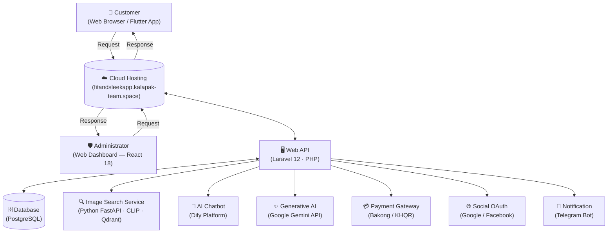

# FitAndSleek — System Architecture

> **System:** FitAndSleek E-Commerce System
> **Stack:** Laravel 12 · PostgreSQL · React 18 · Flutter · Python FastAPI (CLIP / Qdrant)

---

## Architecture Overview

The FitAndSleek system follows a **client-server architecture** hosted on cloud infrastructure. Two types of clients interact with the system through a central cloud hosting layer, which routes all traffic to a RESTful Web API backed by a relational database and supplementary AI/ML services.



---

## Components

### 1. Customer Client — Flutter / Web Browser

| Attribute     | Detail                                                  |
|---------------|---------------------------------------------------------|
| **Technology** | Flutter (Web & Mobile)                                 |
| **Role**       | End-user facing storefront                             |
| **Functions**  | Browse products, manage cart, checkout, track orders, image search, AI chat, wishlist, replacement requests |
| **Communication** | HTTPS REST calls → Cloud Hosting                    |

---

### 2. Administrator Client — Web Dashboard

| Attribute     | Detail                                                  |
|---------------|---------------------------------------------------------|
| **Technology** | React 18                                               |
| **Role**       | Back-office management console                         |
| **Functions**  | Manage products, categories, orders, users, drivers, promotions, shipments, analytics |
| **Communication** | HTTPS REST calls → Cloud Hosting                    |

---

### 3. Cloud Hosting

| Attribute     | Detail                                                        |
|---------------|---------------------------------------------------------------|
| **Host**       | `fitandsleekapp.kalapak-team.space`                          |
| **Role**       | Entry point; terminates TLS, routes traffic to the Web API   |
| **Inbound**    | Requests from Customer clients and Administrator clients      |
| **Outbound**   | Responses back to clients; forwards to Web API               |

---

### 4. Web API

| Attribute     | Detail                                                      |
|---------------|-------------------------------------------------------------|
| **Technology** | Laravel 12 (PHP), served on port 8000                      |
| **Role**       | Core business logic layer; RESTful API                      |
| **Functions**  | Authentication (Sanctum + 2FA + OAuth), product catalogue, order management, payment processing, driver assignment, chat relay, image search proxy, notification dispatch |
| **Communication** | Bidirectional with Cloud Hosting; queries PostgreSQL; calls external services |

---

### 5. Database

| Attribute     | Detail                                           |
|---------------|--------------------------------------------------|
| **Technology** | PostgreSQL                                       |
| **Role**       | Persistent data store for all application data   |
| **Key Stores** | Users, products, orders, payments, shipments, wishlist, OTP codes, device sessions, reviews, promotions, categories |
| **Communication** | Bidirectional with Web API only              |

---

### 6. External & AI Services

| Service | Technology | Purpose |
|---------|-----------|---------|
| **Image Search** | Python FastAPI + CLIP + Qdrant | Vector-based visual similarity search for products |
| **AI Chatbot** | Dify Platform | Conversational assistant for customer support |
| **Generative AI** | Google Gemini API (`gemini-1.0-pro`) | Natural-language content generation & smart replies |
| **Payment Gateway** | Bakong / KHQR | Cambodian QR-based payment processing |
| **Social OAuth** | Google OAuth 2.0 · Facebook Login | Third-party authentication |
| **Notifications** | Telegram Bot API | Order alerts and system notifications |

---

## Communication Flow

```
Customer / Admin Client
        │  HTTPS Request
        ▼
  Cloud Hosting  ◄──── TLS Termination / Reverse Proxy
        │
        │  Internal Route
        ▼
    Web API (Laravel 12)
        │
        ├──► PostgreSQL Database  (read / write)
        ├──► Python FastAPI        (image vector search)
        ├──► Dify Platform         (chatbot messages)
        ├──► Google Gemini API     (AI generation)
        ├──► Bakong / KHQR         (payment QR & status)
        ├──► Google / Facebook     (OAuth token exchange)
        └──► Telegram Bot          (push notifications)
        │
        │  HTTPS Response
        ▼
  Cloud Hosting
        │
        ▼
Customer / Admin Client
```

---

## Architectural Style

| Property | Decision |
|----------|----------|
| **Pattern** | Client–Server, 3-Tier (Client · API · Database) |
| **API Style** | RESTful JSON over HTTPS |
| **Authentication** | Laravel Sanctum (token-based) + 2FA (TOTP / OTP email) + OAuth 2.0 |
| **Deployment** | Cloud-hosted (single domain, reverse-proxy to Laravel) |
| **AI/ML Integration** | Sidecar services called via HTTP from Web API |
| **Scalability** | Horizontal scaling at API tier; stateless API design |
